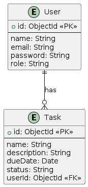
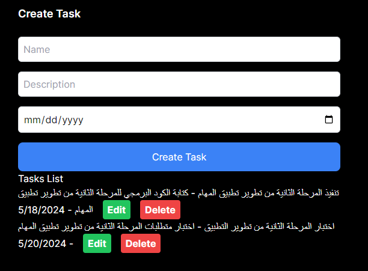

# Taskat

## أهداف المشروع والغرض منه

**الهدف:**
إنشاء نظام شامل لإدارة المهام يسمح للمستخدمين بإدارة المهام بكفاءة.

**الأهداف:**

1. تمكين المستخدمين من إنشاء وقراءة وتحديث وحذف المهام.
2. توفير واجهة مستخدم سهلة الاستخدام لإدارة المهام.
3. ضمان سلامة وأمن البيانات.

## دراسة مقارنة

### الأنظمة الحالية التي تم تحليلها

1. **Trello**

   - **نقاط القوة:** سهل الاستخدام، مرن، يمكن عمل تكامل له مع العديد من الأدوات.
   - **نقاط الضعف:** الميزات المجانية محدودة، قد يكون معقداً للمستخدمين الجدد.

2. **Asana**

   - **نقاط القوة:** ميزات قوية لإدارة المشاريع، أدوات التعاون.
   - **نقاط الضعف:** مكلف للحصول على الميزات المميزة، منحنى تعلم حاد.

3. **Microsoft To Do**
   - **نقاط القوة:** واجهة بسيطة، يمكن عمل تكامل له مع منتجات مايكروسوفت.
   - **نقاط الضعف:** ميزات محدودة، بسيط لإدارة المشاريع المتقدمة.

### التقييم

سيجمع نظامنا بين نقاط القوة لهذه الأدوات مع معالجة نقاط ضعفها من خلال تقديم مجموعة متوازنة من الميزات المناسبة للاستخدام الشخصي والجماعي، مع التركيز على البساطة والكفاءة.

## ERD (مخطط العلاقات بين الكيانات)

### الكيانات

1. **User (المستخدم)**

   - `id` (مفتاح رئيسي)
   - `name` (الاسم)
   - `email` (البريد الإلكتروني)
   - `password` (كلمة المرور)
   - `role` (الدور)

2. **Task (المهمة)**
   - `id` (مفتاح رئيسي)
   - `title` (العنوان)
   - `description` (الوصف)
   - `dueDate` (تاريخ الاستحقاق)
   - `status` (الحالة)
   - `userId` (مفتاح أجنبي)

@startuml
entity User {
+id: ObjectId <<PK>>
--
name: String
email: String
password: String
role: String
}

entity Task {
+id: ObjectId <<PK>>
--
name: String
description: String
dueDate: Date
status: String
userId: ObjectId <<FK>>
}

User ||--o{ Task : "has"
@enduml



### العلاقات

- **User-Task (مستخدم-مهمة):** واحد إلى متعدد (مستخدم واحد يمكن أن يكون لديه العديد من المهام)

## RTM (مصفوفة تتبع المتطلبات)

| معرف المتطلب | الوصف                           | وظيفي | غير وظيفي | الحالة      |
| ------------ | ------------------------------- | ----- | --------- | ----------- |
| R1           | التوثق من المستخدم والتفويض     | نعم   | لا        | قيد التنفيذ |
| R2           | إنشاء وقراءة وتحديث وحذف المهام | نعم   | لا        | تم التنفيذ  |
| R3           | واجهة مستخدم سهلة الاستخدام     | لا    | نعم       | تم التنفيذ  |
| R4           | سلامة وأمن البيانات             | لا    | نعم       | قيد التنفيذ |

## مصفوفة تتبع المتطلبات المبسطة

| معرف المتطلب | الوصف                           | وظيفي | الحالة     |
| ------------ | ------------------------------- | ----- | ---------- |
| R1           | إنشاء وقراءة وتحديث وحذف المهام | نعم   | تم التنفيذ |
| R2           | واجهة مستخدم سهلة الاستخدام     | نعم   | تم التنفيذ |

## متطلبات المنتج القابل للتطبيق الأدنى (MVP)

1. عمليات CRUD للمهام
2. واجهة مستخدم أساسية
3. التحقق الأساسي من صحة البيانات

## الجدول الزمني للمشروع

| المرحلة              | تاريخ البدء | تاريخ الانتهاء | الحالة      |
| -------------------- | ----------- | -------------- | ----------- |
| تحليل المتطلبات      | 03/03/2024  | 11/03/2024     | مكتمل       |
| تصميم النظام         | 11/03/2024  | 16/03/2024     | مكتمل       |
| التطوير - المرحلة 1  | 17/04/2024  | 29/04/2024     | مكتمل       |
| الاختبار - المرحلة 1 | 29/04/2024  | 05/05/2024     | مكتمل       |
| التطوير - المرحلة 2  | 05/05/2024  | 18/05/2024     | لم يبدأ بعد |
| الاختبار - المرحلة 2 | 18/05/2024  | 20/05/2024     | لم يبدأ بعد |
| النشر                | 20/05/2024  | 23/05/2024     | لم يبدأ بعد |

## تصميم واجهة المستخدم

### الرسوم التخطيطية (Wireframes)

- **لوحة تحكم المهام**
- **صفحة إنشاء/تعديل المهمة**

### الأدوات المستخدمة

- React لتنفيذ الواجهة الأمامية

### مثال على الرسوم التخطيطية



#### تسجيل المستخدم وتسجيل الدخول

```javascript
// Express.js Backend
const express = require("express");
const router = express.Router();
const bcrypt = require("bcrypt");
const jwt = require("jsonwebtoken");

// User Model
const User = require("../models/user");

// Register Route
router.post("/register", async (req, res) => {
  try {
    const hashedPassword = await bcrypt.hash(req.body.password, 10);
    const user = new User({
      name: req.body.name,
      email: req.body.email,
      password: hashedPassword,
    });
    const newUser = await user.save();
    res.status(201).json(newUser);
  } catch (err) {
    res.status(400).json({ message: err.message });
  }
});

// Login Route
router.post("/login", async (req, res) => {
  try {
    const user = await User.findOne({ email: req.body.email });
    if (user && (await bcrypt.compare(req.body.password, user.password))) {
      const token = jwt.sign({ id: user._id }, process.env.JWT_SECRET, {
        expiresIn: "1h",
      });
      res.json({ token });
    } else {
      res.status(400).json({ message: "Invalid credentials" });
    }
  } catch (err) {
    res.status(500).json({ message: err.message });
  }
});

module.exports = router;
```

#### عمليات CRUD للمهام

```javascript
// Task Model
const mongoose = require("mongoose");

const taskSchema = new mongoose.Schema({
  name: { type: String, required: true },
  description: { type: String, required: true },
  dueDate: { type: Date, required: false },
  status: { type: String, enum: ["pending", "completed"], default: "pending" },
  userId: { type: mongoose.Schema.Types.ObjectId, ref: "User", required: true },
});

const Task = mongoose.model("Task", taskSchema);

module.exports = Task;
```

## خطة التكامل

1. **تكامل الواجهة الأمامية والخلفية:**
   - استخدام Axios لاستدعاءات API من واجهة React الأمامية إلى واجهة Express الخلفية.
2. **تكامل قاعدة البيانات:**
   - استخدام Mongoose لعمليات MongoDB.
   - ضمان تناسق البيانات وسلامتها باستخدام تحقق المخططات.

## استراتيجية الاختبار

نخطط للقيام بإجراء لاختبارات وفق المراحل التالية

### الاختبار الوحدوي Unit Test

- الأدوات: Jest, Mocha
- النطاق: الوظائف الفردية والوحدات

### اختبار التكامل Integration Test

- الأدوات: Supertest (لنقاط نهاية API)
- النطاق: التفاعل بين الوحدات

### الاختبار الشامل End-To-End Test

- الأدوات: Cypress, Selenium
- النطاق: تدفقات المستخدم الكاملة واختبارات الواجهة

### مثال على حالة اختبار

```javascript
// Example Jest Test Case
const request = require("supertest");
const app = require("../app"); // Your Express app

describe("Task API", () => {
  it("should create a new task", async () => {
    const res = await request(app).post("/tasks").send({
      name: "Test Task",
      description: "This is a test task",
      dueDate: "2024-06-01",
    });
    expect(res.statusCode).toEqual(201);
    expect(res.body).toHaveProperty("_id");
  });
});
```

## خطوات النشر

### النشر المحلي

1. **بدء MongoDB**: تأكد من تشغيل MongoDB محليًا.

   ```bash
   mongod
   ```

2. **إعداد الخلفية**:

   ```bash
   cd backend
   npm install
   npm start
   ```

3. **إعداد الواجهة الأمامية**:

   ```bash
   cd frontend
   npm install
   npm run dev
   ```

### النشر في الإنتاج Deployment Into Production

1. **إعداد البيئة:**
   - تكوين المتغيرات البيئية في ملف `.env` للإنتاج.
2. **بناء الواجهة الأمامية**:

   ```bash
   npm run build
   ```

3. **نشر الخلفية والواجهة الأمامية:**
   - استخدم خدمات الاستضافة مثل Digitalocean.
   - تأكد من تكوين البيئة بشكل صحيح وإعدادات الأمان.
